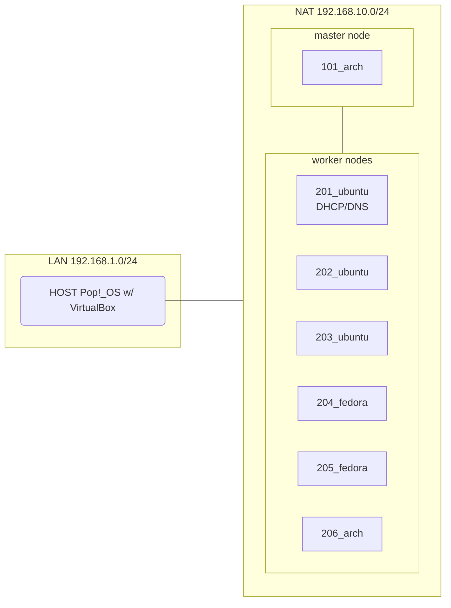

# Laboratorio de Kubernetes

## Cluster en VirtualBox

<details>
<summary>Diseño del Laboratorio</summary>



</details>

- [docs/virtualbox_nat.md](/docs/virtualbox_nat.md): instalación de máquinas virtuales, configuración de DHCP y DNS (en `201_ubuntu`) para direccionamiento IP estático
  - **Distros**: Ubuntu y Fedora (worker nodes), Archlinux (master node)


## Administración de Kubernetes

### Instalación

- [scripts/INSTALL.sh](/scripts/INSTALL.sh): automatizar la instalación de *Kubernetes* y [*Calico*](https://docs.tigera.io/calico/latest/getting-started/kubernetes/quickstart) en máquinas virtuales Ubuntu, Fedora y Arch ([demo en youtube](https://www.youtube.com/watch?v=G5n0Z-OVup4))

```bash
# Ejecutar script desde las máquinas del laboratorio
bash -c "$(curl -fsSL https://raw.githubusercontent.com/pabloqpacin/k8s-bs/main/scripts/INSTALL.sh)"
```

<!-- ### Mantenimiento

- [cheatsheets/utils] -->


