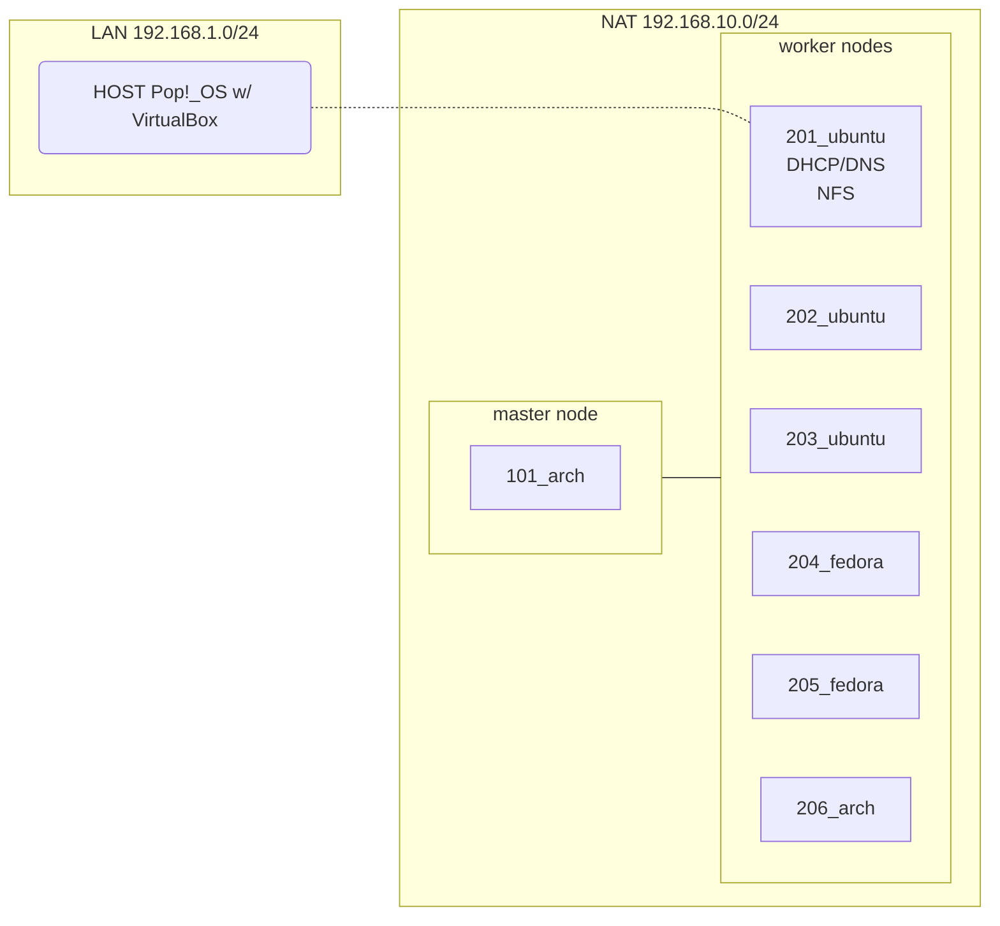

# Laboratorio de Kubernetes

## Cluster en VirtualBox

<details>
<summary>Diseño del Laboratorio</summary>



</details>

- [docs/virtualbox_nat.md](/docs/virtualbox_nat.md): instalación de máquinas virtuales en red NAT, configuración de DHCP y DNS (en `201_ubuntu`) para direccionamiento IP estático, ejecución de `INSTALL.sh`
  - **Distros**: Ubuntu y Fedora (worker nodes), Archlinux (master node)


## Administración de Kubernetes

### Instalación

- [scripts/INSTALL.sh](/scripts/INSTALL.sh): automatizar la instalación de *Kubernetes* y [*Calico*](https://docs.tigera.io/calico/latest/getting-started/kubernetes/quickstart) en máquinas virtuales Ubuntu, Fedora y Arch ([demo en youtube](https://www.youtube.com/watch?v=G5n0Z-OVup4))

```bash
# Ejecutar script desde las máquinas del laboratorio
bash -c "$(curl -fsSL https://raw.githubusercontent.com/pabloqpacin/k8s-bs/main/scripts/INSTALL.sh)"

# Una vez hay un nodo master, introducir esto en los workers
sudo kubeadm join 192.168.10.101:6443 --token b2kh64.yttzy1f96n9jxatn \
        --discovery-token-ca-cert-hash sha256:3f58b0c51a9a5ffa6585928864be8ebf371a99851b4f67c6c65d48b39b57fa6a

```

<!-- ### Mantenimiento

- [cheatsheets/utils] -->


## Otros materiales

- [docs/curso-parte1](/docs/curso-parte1.md)
- [docs/curso-parte2](/docs/curso-parte2.md)
- [gist: k8s-wordpress-mysql.yaml](https://gist.github.com/pabloqpacin/869a66beca9f3d7b68e28f992f4d55c5)

